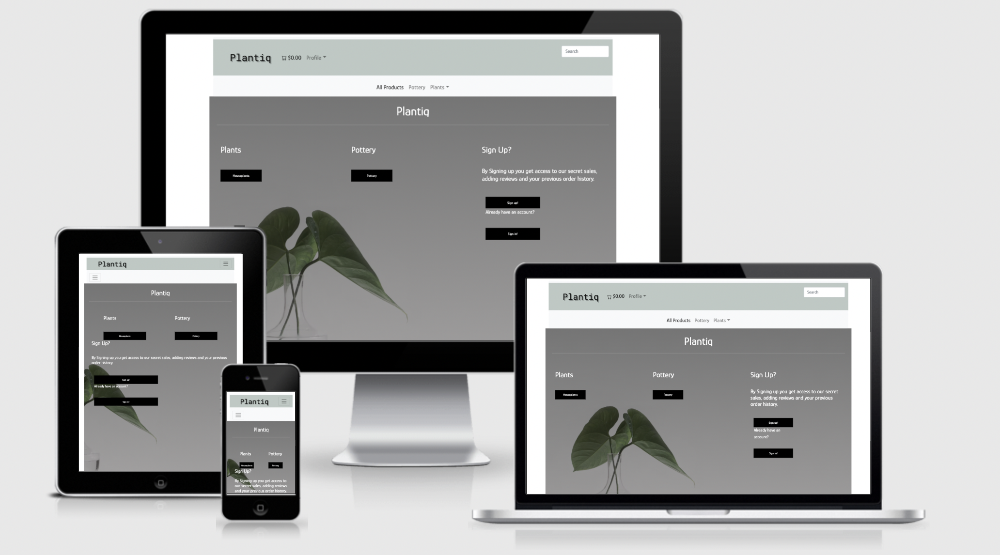
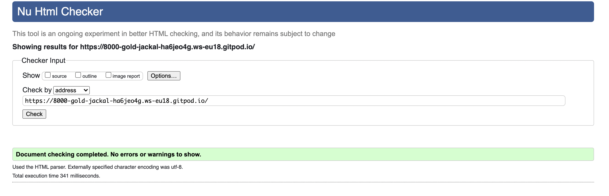
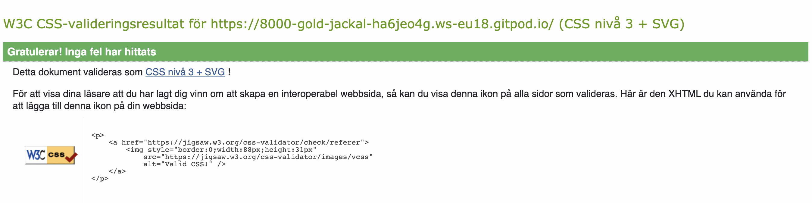
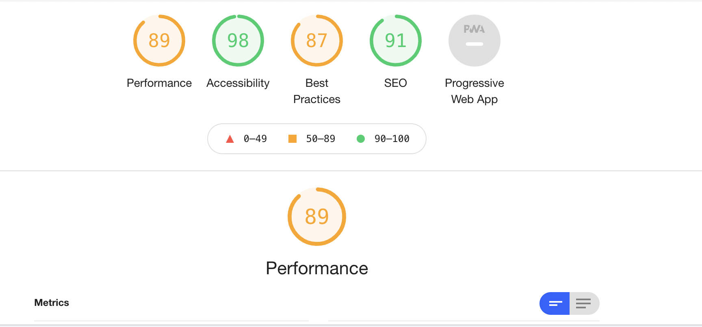

# Plant Shop Django Project

  

## About
Plantiq is educational a fullstack Django ecommerce website where plants and pottery are being sold online.
  
[Live website](https://plantiq.herokuapp.com/)

- [Plant Shop Django Project](#plant-shop-django-project)
  * [About](#about)
  * [User Stories](#user-stories)
    + [Store owner](#store-owner)
    + [General user (applies for registrered and not registrerd users)](#general-user--applies-for-registrered-and-not-registrerd-users-)
    + [User who is not registrered](#user-who-is-not-registrered)
    + [Logged in User](#logged-in-user)
- [Design choices](#design-choices)
    + [Colours](#colours)
    + [Fonts](#fonts)
    + [Frameworks](#frameworks)
  * [Wireframes](#wireframes)
  * [Features](#features)
  * [Features implemented](#features-implemented)
      - [Across the website the user has access to the navbar](#across-the-website-the-user-has-access-to-the-navbar)
      - [Landing page/home](#landing-page-home)
      - [All products page](#all-products-page)
      - [Plants page](#plants-page)
      - [Houseplants](#houseplants)
      - [Indoor Plants](#indoor-plants)
      - [Outdoor Plants](#outdoor-plants)
      - [Pottery](#pottery)
      - [Product detail page](#product-detail-page)
      - [Cart](#cart)
    + [Checkout](#checkout)
    + [Checkout success](#checkout-success)
    + [Profile Page](#profile-page)
    + [Log In/ Sign Up/ Log out](#log-in--sign-up--log-out)
    + [Product Management](#product-management)
    + [Edit Product](#edit-product)
  * [Features left to implement](#features-left-to-implement)
- [Testing](#testing)
  * [Testing Reponsivness](#testing-reponsivness)
    + [Index fix:](#index-fix-)
    + [Navbar fix:](#navbar-fix-)
    + [HTML](#html)
    + [CSS](#css)
    + [JavaScript](#javascript)
    + [Python](#python)
    + [Lighthouse](#lighthouse)
  * [Testing User Stories](#testing-user-stories)
    + [Store Owner](#store-owner)
    + [General user](#general-user)
    + [User who is not registrered](#user-who-is-not-registrered-1)
        * [As a user who is not registrered I want the benefits of signing up to be made clear](#as-a-user-who-is-not-registrered-i-want-the-benefits-of-signing-up-to-be-made-clear)
    + [Logged in User](#logged-in-user-1)
        * [See my previous order details](#see-my-previous-order-details)
        * [For my personal details to be saved/prefilled to speed up checkout](#for-my-personal-details-to-be-saved-prefilled-to-speed-up-checkout)
    + [Manual Testing](#manual-testing)
    + [Known bugs/errors](#known-bugs-errors)
  * [Database](#database)
    + [Apps](#apps)
- [Deployment](#deployment)
    + [Heroku:](#heroku-)
    + [Local Deployment](#local-deployment)
- [Technologies](#technologies)
- [Credits](#credits)

## User Stories

### Store owner

* As the store owner I want to be able to log in as admin to acces the following functionality:

* Adding products to the database

* Editing existing products in the database

* Deleting products in the database

* As the store owner I would naturally also want to view existing products and for the functionality for the rest of the website to be functional and easily understood to the customers.

* As a store owner I would want for the website to increase sales.

* As a store owner I would want my customers to create accounts

  

### General user (applies for registrered and not registrerd users)

* As a general user I want the website to be easily navigated with a conpect that is clear

* As a general user I want to be able to search for specific items or categories, for example: hydrangea (product) or autumn (categories).

* As a general user I want to be able to sort products based on pricing in the category section

* As a general user I want to be able to view my cart

* To be able to view product details

* As the general user when shopping:

* To be able to delete and add more items of the same product to my cart at checkout

* Identify the total cost of my purchase

* Get redirected to my order details

* To be able to make a purchase

  

### User who is not registrered

* As a user who is not registrered I want the benefits of signing up to be made clear

  

### Logged in User

* See my previous order details

* To my personal details to be saved/prefilled to speed up checkout

 # Design choices
 My initial idea with the website was to create a online webshop for plants and flowers. After browsing a couple of other online plantshops I wanted to implement and strive for a design that doesn't feel to complex or stressfull and varies in colours that are close to nature.
 ### Colours
 The colourpallette for this website is different shades of green as well as white, black and grey. 

### Fonts 
I've implemented Google Fonts for this website, I've used the font 'Glory' with sans-serif as backup-font. For icons I've used the Bootstrap icon gallery.

### Frameworks
* Bootstrap 5: 
   A framework that gives great access to stylistic choices that would otherwise take some time to write manually in the css file. 
  
 ## Wireframes
   [Wireframes](https://github.com/hddahdda/plant_ecommerce/blob/main/readmefiles/wireframes.png)

## Features
## Features implemented
#### Across the website the user has access to the navbar
* Not logged in users has access to Sign Up via the profile button in the navbar.
* Logged in users has access to Log Out or view their profile via the profile button in the navbar. 
* Superusers has access to view their profile, log out or Add product from the navbar via "Product Management".
* All users have access to the search bar.
* All users has the ability to redirect to the home page by clicking the title "Plantiq" in the navbar.
* All users has access to view the "All Products", "Plants" and "Pottery" pages through the navbar.
* The cart button is also a link which the user can access to view their products, the link updates accordingly as the user adds products to their cart.

#### Landing page/home
* All users have access to the landing page where they also have the opportunity to access the plants or pottery page as well as signing up or logging in if they are an existing user.

#### All products page
* The all products page displays all the products that are currently in the database. All users has the ability to view the products in detail from this page.
* The products are displayed with their main image as well as product name, and category. By clicking the "View Product" button the user has access to the product detail view.
* Superusers have the ability to edit or delete a product from this view by either clicking "Edit" or "Delete".

#### Plants page
* Same view as all products but only products of the category "plants" are viewed.

#### Houseplants 
* Same view as all products but only products of the category "houseplants" are viewed.

#### Indoor Plants 
* Same view as all products but only products of the category "Indoor plants" are viewed.

#### Outdoor Plants 
* Same view as all products but only products of the category "Outdoor plants" are viewed.

####  Pottery 
* Same view as all products but only products of the category "Pottery" are viewed.

#### Product detail page
* In the product detail page the user can read the product description, see multiple images of the same product and att items to the cart.
* The logged in user has the ability to add a review of the product.
* The superuser has permission to edit or delete and item from the product detail view.
* The user can add multiple products of the same product to their cart.

#### Cart
* The user can access the cart by clicking on the cart button on the top right corner.
* The user can view their cart if they have any products in their current cart, otherwise, the cart will display as empty.
* The user can go back to the all products page to continue shopping.
* The user can update or delete items in their current cart.
* The user can view their products total + shipping cost or how much more they need to spend to get free shipping.
* The user can proceed to checkout.

### Checkout
* The user can access checkout via the Cart page.
* The user can view their full order.
* The user is prompted to fill out their shipping details.
* The user is able to save their shipping details to their profile page.
* The user is able to make a purchase via Stripe.

### Checkout success
* The user has the ability to review their products and shipping details after completin a purchase. 

### Profile Page
* The user can access their profile page by logging in and/or signing up for the site.
* The user can view their previous order history details.
* The user can update their shipping details if necessary.

### Log In/ Sign Up/ Log out
* Provided by Django allauth these pages are used for the user to either log in, log out or signing up if not an existing user. These can be accessed through the navbar.

### Product Management
* As a superuser aka storeowner or developer the user has access to, via the frontend, add products to the database.

### Edit Product
* The store owner can access the edit product page through the product detail page or the all products page.

## Features left to implement 

* For a user to be able to sign up or logging in by using their social media account
* For the superuser to be able to be edit, add and update the product detail image from the front-end. For now the superuser only has the ability to access this feature via the django admin. 
* For the customer to review previous reviews, for now the reviews added by customers only go to the database and aren't displayed anywhere on the website.
* Adding toasts

 # Testing
 ## Testing Reponsivness
 When I initially tested my websites responsiveness I became aware that the website landing page broke when using a smaller device. Also the button for profile switched place which made it impossible for the user to view the list display (log out, my profile, log in, register).
 ### Index fix:
 Fixing the index page was just as easy as adding the bootstrap classes col-md-6 and col-sm-12.
### Navbar fix:
This issue was fixed by implementing the bootstrap navbar toggle. 

### HTML
I used the [HTML validator](https://validator.w3.org/) for all pages, when using it for the base.html page I ran in to some issues which has yet to be resolved. It seems the validator doesn't want for the navbar to end where it does.

FIXED
This issue was fixed by implementing a new navbar.

### CSS
I used the `[CSS validator](https://jigsaw.w3.org/css-validator/)` for my project. No errors.

### JavaScript
I used [JSHint](https://jshint.com/) which is a JavaScript validator tool to validate my js, no errors. 

### Python
I've used the python extension Pylint to format and remow whitespaces from my code.

### Lighthouse

## Testing User Stories
### Store Owner
| Test Description| Expected Outcome | Result   |
| :---        |    :----:   |          ---: |
| Adding products to the database      | That the user is able to add products to the database   | The user is able to add products  |
Editing existing products in the database |    The user should be able to edit a existing product.| The user is able to edit a existing product.
| Delete Product     |  The user should be able to delete a product     | The user is able to delete products|
| As the store owner I would naturally also want to view existing products and for the functionality for the rest of the website to be functional and easily understood to the customers.   | The websites purpose should be easy to grasp     | Website is functional. |   |
| As a store owner I would want for the website to increase sales.    | .-.    | Difficult to test|
|  As a store owner I would want my customers to create accounts | Customers are able to create accounts    | Does work      |
| 

###  General user
| Test Description| Expected Outcome | Result   |
| :---        |    :----:   |          ---: |
|  As a general user I want the website to be easily navigated with a concept that is clear      | That the website is easily navigated and accessible     | The navbar is structured and the landing page makes it clear which kind of website the user is browsing. |
As a general user I want to be able to search for products |    The user should be able to search for products| The user is able to search for products
| As a general user I want to be able to view my cart     |  The user should be able to view their cart      | The user is able to view their cart|
| To be able to view product details   | The user should be able to view product details     | User is able to access the product details page    |
| To be able to delete and add more items of the same product to my cart at checkout     | .-.    | Does work  |
|Identify the total cost of my purchase  | .-.     | Does work      |
|  Get redirected to my order details      | The user should be redirected after a purchase       | Works well. |
| To be able to make a purchase  | The user should be able to make a purchase    | Stripe integration is working, however the user is not able to make an actual purchase.
| 
  
### User who is not registrered

##### As a user who is not registrered I want the benefits of signing up to be made clear 
The user who is not registred is prompted to do so they can view their previous order details, save their information and add reviews. This is displayed on the front -page, in checkout and in the product details page.

### Logged in User

##### See my previous order details
The user is able to view their previous checkout details in their profile.
##### For my personal details to be saved/prefilled to speed up checkout
If the user has chosen such, this feature is implemented.

### Manual Testing
| Test Description| Expected Outcome | Result   |
| :---        |    :----:   |          ---: |
| Navbar      | When links in navbar are clicked they should lead to correct page. The navbar should be accessible on all devices.      | The links are all working, however the issue with the navbar remained. FIXED |
Search|    The user should be able to search within the database| The user is able to search for products
| Signing Up     |  The user should be able to Sign up for the website    | The user is able sign up successfully |
| Logging in  | The user should be able to log in to the database    | User is able to log in    |
| Viewing order details and saved information   | The user should be able to view their profile page and information     | Does work  |
| Adding products to the database  | Admin should be able to add products to the database through the front-end     | Does work      |
| Delete and Update      | The admin should be able delete and edit existing products     | Works. |
| Payment  | The user should be able to make a Stripe purchase   | Does work, webhooks are working.
| Add review to database  | A user should be able to add a review to the database    | Working
| 

### Known bugs/errors
Apart from the HTML validation error the user is not able to view the reviews written by other users nor themselves. This is stored in the database but not displayed for the users.

The product detail image needs to be updated from the Django Admin as for now. This will also be a future feature to implement. 

## Database
During development I've used SQLite3 which is the Django prebuilt database  but in production PostgreSQL was used. 

### Apps
This project consists of these apps:
* Products
* Checkout
* Cart
* User
* Home
* Review

Models written by me are:
Images - Can be found in the Products app, used to display several images in the product detail view. This contains the foreign key of 
Product.
Review - Found in the review app, used for adding reviews on products to the database. This contains two foreign keys, Product and User.

# Deployment
### Heroku:
* Clone this repo
* Open in IDE, I have used GitPod during the development of this project and highly recommend it. 
* In my requirements.txt file the requirements to run this project are shown. Please make sure to install these:

  * pip3 install django    * pip3 install django-allauth   * pip3 install pillow   * pip3 install django-storages   * pip3 install dj_database_url   * pip3 install stripe   * pip3 install psycopg2-binary
  * Then proceed by typing pip3 freeze > requirements.txt
  * Install gunicorn: pip3 install gunicorn
  * Add a Procfile, add this line to your Procfile, replace your app name with the name of your project.

> web: gunicorn <your_app_name>sw.wsgi:application
* git push

 * Create a new app in Heroku, this can be done from the Heroku dashboard.
 * Chose the region closest to you
 * Add postgres as database
 * Go back to GitPod, import dj_database_url in your settings.py file. 
 * Add your new db settings to your settings.py

     DATABASES = {
    
    'default': dj_database_url.parse('postgres:///')
    
    }
  
  * If wanted, you can load the json filed to populate your Postgres database in Heroku. This is done by typing: python `manage.py loaddata <JSON filename>`, for the database to be correct, do this in the following order:
     * Categories
     * Products
     * Images
  
  * Migrate your changes
  * Type python3 `manage.py createsuperuser` to create a user who will have access to your admin panel when deployed.
  * Type heroku config:set `DISABLE_COLLECTSTATIC=your_app_name`  in your cli so that heroku doesn't collect your static files (If you wan't to use AWS).
  * Change database settings so that postgres url is a hidden. 
  * git push
  * git push heroku main 
  * Set up your secret keys and variables in Heroku's config vars. These are  to be kept secret. 
  * Also make sure that heroku is listed as an allowed host in your settings.py.

To set up automatic deployment via Heroku you need to search for your GitHub repo in your apps deployment tab and then towards the bottom select that you wan't to enable automatic deploys. This way, every time you push to GitHub you also push to Heroku.
 
 If you're planning on deploying this to Amazon Web Services you will need to create an account and a bucket to host your static files. The bucket uses s3 which is a cloud object storage. 

### Local Deployment
To deploy this project locally follow these steps.
* Use IDE of choice that has the ability to run or install Python, pip (Python install packages).
* Make sure your that you've updated your requirements files according go the requirements.txt file found in this directory.
* To run type `python3 manage.py runserver` in your CLI. 
* To migrate type python3 `manage.py makemigrations --dry-run` to see which migrations are new.
* If everything looks correct type: `manage.py makemigrations` and you will see that these are created.
* To migrate them to the database type python3 `manage.py migrate --plan` and note that it looks correct. 
* If it does, go ahead and migrate: `python3 manage.py migrate`

# Technologies
Front-end:
* HTML5 
* CSS3
* JavaScript
* Jquery
* Bootstrap
* Google Fonts

Back-end:
* Python3
* Django
* Stripe
* Postgres Database (Heroku)
* Amazon Web Services

Other/Tools:
* Git
* GitPod
* Balsamiq Wireframes
* Heroku

# Credits
* Boutiqe Ado project:
The boutique Ado project was of big help when creating this project and I have been following is in my development for this website. In both creating a lot of my models aswell as Stripe integration, amazon web services hosting and how to create the proper JavaScript when proceeding checkout.
* Code for checkout page (HTML + CSS) from [bbbootstrap](https://bbbootstrap.com/snippets/bootstrap-ecommerce-shopping-cart-item-summary-44021562) Which was of great help when creating a clean checkout template.
* [Unsplash](https://unsplash.com/) was used for all images.
* Code Institute Tutors for their support  in deployment, bug resolving and a lot of other issues.
